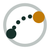
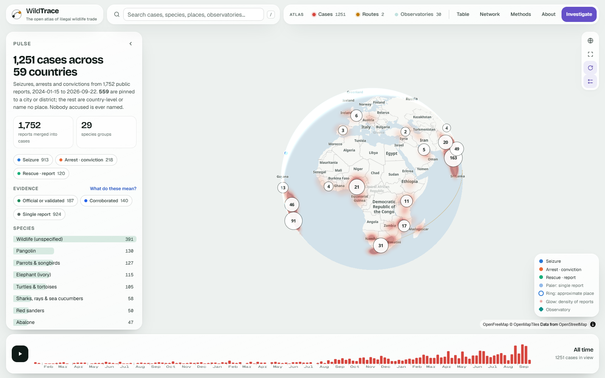
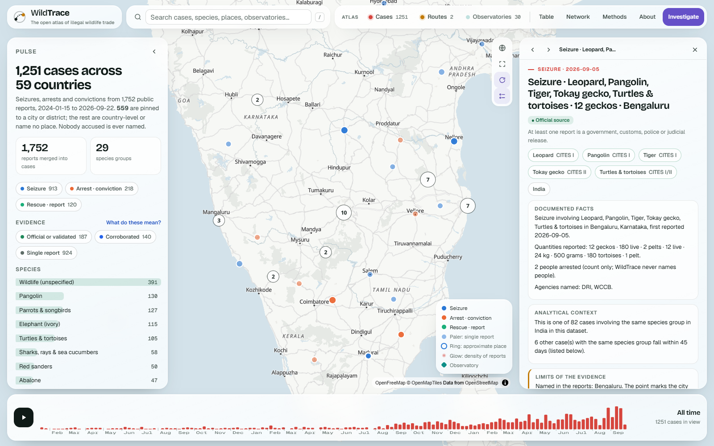
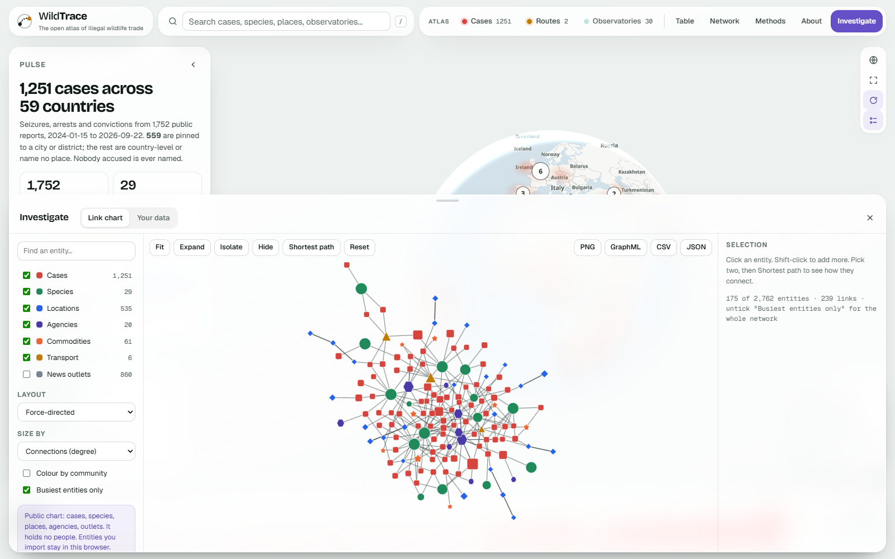
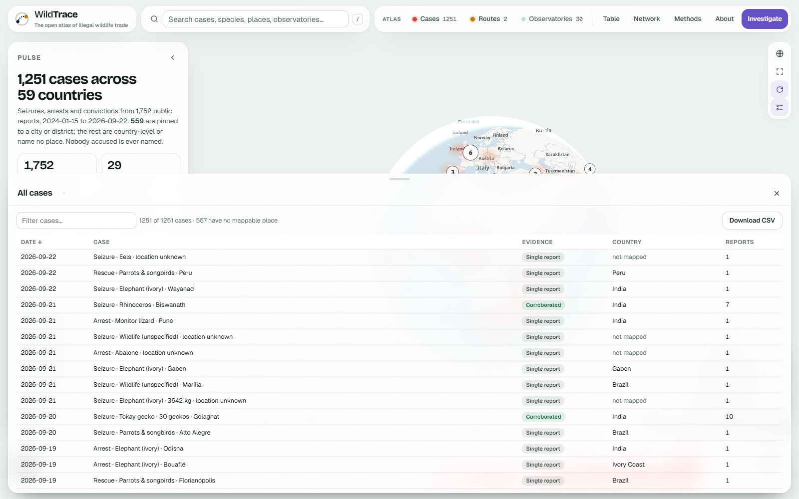
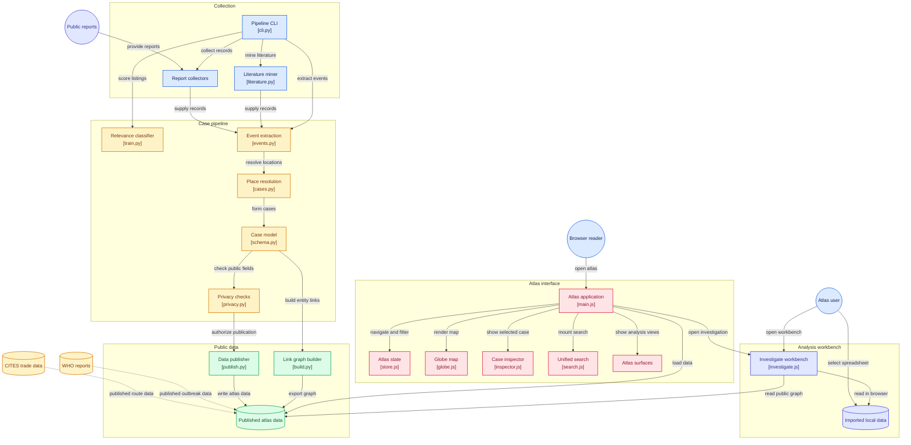

<div align="center">



# WildTrace

**The open atlas of illegal wildlife trade.**

One map of seizures, arrests and convictions worldwide, in fauna and flora, with every case
graded by the strength of its evidence, and a link-analysis workbench that runs in your browser.

[](https://github.com/tarunv13/wildtrace/actions/workflows/ci.yml)
[](https://github.com/tarunv13/wildtrace/releases)
[](LICENSE)
[](#data-licence-and-citation)
[](https://doi.org/10.5281/zenodo.22902819)

[Open the Atlas](https://tarunv13.github.io/wildtrace/) ·
[Who it's for](#who-its-for) ·
[How much to trust a case](#how-much-to-trust-a-case) ·
[Download the data](https://tarunv13.github.io/wildtrace/data/cases.csv) ·
[Run it yourself](#run-it-yourself) ·
[How to cite](#how-to-cite) ·
[Contributing](CONTRIBUTING.md)

</div>

<p align="center">
  
  <br>
  <sub>The Atlas: 1,251 cases in 59 countries. Colour is the kind of event, paler dots are single reports, the glow is density of reporting.</sub>
</p>

---

## Why WildTrace

- **Every case says how well it is evidenced.** Validated, official, corroborated or single
  report, shown on the map, in the case panel and in the CSV. A case built on one local news
  story never looks like a case confirmed by a customs release.
- **It is honest about its gaps.** The map says how many cases it could not place, and states
  plainly that counts show where wildlife crime is *reported*, not where it happens.
- **Fauna and flora.** Ivory, pangolin and rhino horn, but also rosewood, agarwood and red
  sanders, in 31 species groups and nine languages.
- **Anyone can challenge a case.** Every case panel has a Report a correction link. Reviewers
  record the outcome in a file in this repository, and rejected cases disappear at the next build.
- **The data is yours.** One CSV, CC BY 4.0, with the JSON behind the map beside it. No account,
  no API key, no account. Usage is measured with Microsoft Clarity, which is stated on the site.
- **Nobody accused is named.** No names, phone numbers, addresses or seller identities are ever
  published. The build fails if one gets through, and CI checks again.

|  | WildTrace | Commercial and closed IWT dashboards |
| --- | --- | --- |
| Cost | Free | Licence, subscription or membership |
| Source code | Open (MIT) | Closed |
| Case-level data | CSV and JSON, CC BY 4.0 | Aggregates or on request |
| Evidence grading per case | Yes, four levels | Rare; usually one confidence figure or none |
| Link analysis | In the browser, free | i2 Analyst's Notebook and similar, paid |
| Your own data | Stays in your browser | Uploaded to a server |
| Scope | Global, fauna and flora | Often one region or one taxon |

WildTrace is young, and it does not replace the field's reference datasets. It points to them
instead: the [observatory network](docs/OBSERVATORIES.md) lists 33 datasets, dashboards and
codebooks, with what each holds and its access terms. The CITES Trade Database, ETIS, LEMIS,
UNODC World WISE and TRAFFIC's portal hold records WildTrace will never match.

## Who it's for

| You are | What WildTrace gives you |
| --- | --- |
| Investigative journalism | A searchable base of public seizures with every source link, and a link chart to find what connects them |
| Enforcement and customs analysis | Reported routes, transport modes, commodities and the agencies named, exportable as CSV, GraphML or JSON |
| NGOs and conservation programmes | A global picture with country and species filters, free to embed, fork or re-host |
| Researchers and students | A citable dataset with a DOI, an open method, and a classifier trained on a published labelled set |
| Policy and CITES work | Where trade in a listed species is being reported, and how strong that reporting is |
| Anyone with their own spreadsheet | Import CSV, Excel or JSON into the workbench and chart it against the public data, all in your browser |

## The Atlas

Everything happens on one globe. The other surfaces float over it, so you can wander without
losing your place.

| Surface | What it does |
| --- | --- |
| **Globe** | Cases by kind, a density glow, reported routes as arcs, observatories. Globe or flat, slow rotation, legend toggle |
| **Flows** | Where wildlife is taken, where it passes through and where it is seized, from 15,512 seized shipments reported to CITES. You build the view: follow a species or a country, choose source and market countries, how many routes, which evidence (seized, declared legal trade, news routes), and colour lines by region, role or species. Every route can be switched off; a story sentence rewrites itself from what is on; the whole view lives in the link |
| **Who supplies whom** | A heatmap of source countries (or regions) against the countries that seized them, for plants, animals or both, with or without the United States; click a cell to draw it |
| **Zoonoses** | A separate lens: 2,116 WHO outbreak reports of animal-borne disease, grouped by how they reach people, with WildTrace cases as rings over them, and a table of the viruses confirmed in each traded species group (VIRION). A shared map, not a cause |
| **Analysis** | What the evidence shows on one sheet: cases per month, events, species, source or market, transport, CITES seizures per year |
| **Search** (`/`) | Cases, species, countries and observatories in one box |
| **Pulse** | A live summary of what is in view; every bar is a filter |
| **Inspector** | A written account of the case, then the documented facts, analytical context and limits of the evidence, with every source listed. Back, forward and a shareable link |
| **Timeline** | Cases per week. Drag to pick a period; ▶ glides through them in time order |
| **Why this matters** | A collapsible trivia box: the scale of the trade, each figure from a named report you can open, plus facts counted from WildTrace's own cases |
| **Tour** | A one-minute walkthrough that spotlights each part of the live interface. Runs once for a new reader, replayable from the Tour button |
| **Table** | Every case, sortable and filterable, with CSV download |
| **Investigate** | A link chart of cases, species, places and agencies, plus your own imported data |
| **Network** | The 33 observatories, databases and codebooks, each checked, with how WildTrace uses them |
| **Methods** and **About** | Pipeline, classifier, evidence definitions, coverage, licence and citation |

<p align="center">
  
  <br>
  <sub>A case record keeps documented facts, analytical context and the limits of the evidence apart. Arrests are counts only; no person is named.</sub>
</p>

<p align="center">
  
  <br>
  <sub>Investigate opens on the best-connected part of the network. Isolate, expand, find the shortest path between two entities, then export to PNG, GraphML, CSV or JSON.</sub>
</p>

<p align="center">
  
  <br>
  <sub>Every case as a table, sortable by any column, with the evidence grade beside it and "not mapped" stated rather than hidden.</sub>
</p>

## How much to trust a case

Every case carries one status:

| Status | Meaning |
| --- | --- |
| **Validated** | A person checked it against its sources, recorded in [`validations.yaml`](pipeline/wildtrace/resources/validations.yaml) with reviewer, date and note |
| **Official** | At least one report is a government, customs, police, prosecutor or court release |
| **Corroborated** | Two or more independent outlets report it |
| **Single report** | One outlet only: a lead, not a finding |

As of the current build: **187 official, 140 corroborated, 924 single report**. Three in four
cases still rest on one outlet, and **557 of 1,251 cases name no place** at all. Those numbers are
on the site, not buried here, because a map that hides them would be misleading.

Found a mistake? Use **Report a correction** on any case, which opens a pre-filled issue.

## Data, licence and citation

- **Download:** [`cases.csv`](https://tarunv13.github.io/wildtrace/data/cases.csv), one row per
  case, with status, place, species and source links. The JSON behind the map sits beside it in
  [`web/data/`](web/data).
- **More downloads:** [`cites_seized_flows.csv`](https://tarunv13.github.io/wildtrace/data/cites_seized_flows.csv)
  (origin, exporter, importer, seized shipments per species group),
  [`cites_declared_flows.csv`](https://tarunv13.github.io/wildtrace/data/cites_declared_flows.csv),
  [`zoonotic_outbreak_reports.csv`](https://tarunv13.github.io/wildtrace/data/zoonotic_outbreak_reports.csv)
  (2,116 WHO reports with disease, pathway and countries) and
  [`species_viruses.csv`](https://tarunv13.github.io/wildtrace/data/species_viruses.csv).
- **Licence:** case data CC BY 4.0, code MIT. `flows.json` is derived from the CITES Trade Database
  and shared under its terms (non-commercial, with attribution); the virus counts in
  `zoonoses.json` come from VIRION under ODbL 1.0.
- **Coverage:** 1,271 cases, 59 countries, 1,788 public reports, 2024-01-15 to 2026-09-22; 15,512
  seized and 7 million declared CITES shipments since 2015; 2,116 zoonotic WHO outbreak reports.

## How it fits together

Collection feeds the case pipeline; only privacy-checked data reaches `web/data`, and the Atlas
and the Investigate workbench read nothing else. CITES and WHO data enter as published aggregates.



<sub>Architecture map generated by <a href="https://gitdiagram.com/tarunv13/wildtrace">GitDiagram</a>
on 23 September 2026. The <a href="https://gitdiagram.com/tarunv13/wildtrace">interactive version</a>
links each box to its source file.</sub>

## How it stays current

A GitHub Actions workflow refreshes the site **every day** (03:17 UTC): new news reports, WHO
outbreak reports and VIRION, then a rebuild and redeploy if anything changed. Government and court
domains and GDELT are swept on Mondays. The collected records are kept in a private archive
repository, because news feed terms allow publishing derived facts only; a build that would
publish over 10% fewer cases than are live stops instead of shrinking the site. CITES flows follow
the CITES release cycle and are refreshed once a year.

## Run it yourself

```bash
pip install -e ".[dev,video]"
wildtrace collect --official --gnews --countries ALL   # official releases + global news
wildtrace collect --history 12 --no-gdelt              # one-off: backfill 12 months
wildtrace build                                        # cases, graph, CSV, site data (privacy gate)
wildtrace cites path/to/Trade_database_download_v2026.1 # yearly: CITES supply -> demand flows
wildtrace zoonoses                                     # weekly: VIRION + WHO outbreak reports
python scripts/make_og.py                              # redraw the share card with the new counts
python -m http.server -d web 8000                      # open http://localhost:8000
```

Optional: `export WILDTRACE_WCS_OWT_DIR=/path/to/OWT` trains the listing classifier on the OWT
labelled set. Other commands: `gazetteer` rebuilds the place index, `codebook <zip>` merges the
PMC8579131 names, `cites <folder>` loads the CITES Trade Database, `relabel` merges classifier
corrections, `doctor` checks tools and sources.

## How a report becomes a case

```
collect ─► screen ─► extract ─► merge ─► link ─► publish
official,   species ×   species, place,   one case per      entity–link     privacy gate,
news,       enforcement route, quantity,  incident, across  graph with      static JSON
listings    cues, minus arrests (count),  languages and     centrality      and CSV
            false cues  agency, mode      story days
```

- **Screening** rejects look-alikes: an ivory-smuggling *film*, "Kasturi" liquor, the Ivory Park
  township.
- **Places** come from the report. Hindi words such as कुशीनगर are transliterated and matched by
  consonant skeleton, and homonyms are settled by the country the text names. Google News links
  are not decoded, because its robots.txt forbids it.
- **Merging** keeps one incident as one case even when Hindi and English reports share no words.
- **Sources** are tiered by domain, so an official release is recognised as one.

[`docs/ARCHITECTURE.md`](docs/ARCHITECTURE.md) has the data contracts and design choices.

## Findable without JavaScript

The Atlas is an application; search engines and AI answer engines need text. Every build also
writes a plain HTML layer from the same data — a page per
[species group](https://tarunv13.github.io/wildtrace/species/pangolin.html), per
[country](https://tarunv13.github.io/wildtrace/country/in.html) and per case, all indexed from
[browse.html](https://tarunv13.github.io/wildtrace/browse.html) — plus `sitemap.xml`, a `robots.txt`
that welcomes AI crawlers, and [`llms.txt`](https://tarunv13.github.io/wildtrace/llms.txt), a plain-text
brief so an answer engine quoting the figures also carries the caveats. Each page states its numbers
in text, names its licence, links its sources, and repeats the line that matters: these counts show
where wildlife crime is *reported*, not where it happens.

## Mining the research literature

News under-reports plants. `wildtrace mine` searches Europe PMC and OpenAlex for trade research and
extracts three things: species names (checked against the GBIF backbone, so a plant is recognisably a
plant), candidate trade names and code words (only from sentences where a paper says a name is used in
trade), and datasets other researchers have published. Nothing is merged automatically: the results
land in `data/interim/*.csv` for a person to accept or reject.

```bash
wildtrace mine --topics flora          # or: codewords, fauna, datasets, all
```

## Coverage

- **39 species groups**, animals and plants: pangolin, ivory, rhino horn, tiger, leopard, jaguar,
  lion bone, African grey parrots, totoaba, glass eels, abalone, plus orchids, cacti and succulents,
  cycads, carnivorous plants, medicinal and aromatic plants, sandalwood, plant resins, wild bulbs,
  rosewood, agarwood and red sanders, in
  English, Hindi, Telugu, Portuguese, Spanish, French, Vietnamese, Thai and Indonesian/Malay,
  plus 2,376 names in 66 languages from the open seized-wildlife codebook (Stringham et al. 2021).
- **46,000 places**: every town above 15,000 people worldwide, every town above 1,000 in South
  and Southeast Asia, every Indian district, key trafficking airports, and native-script names.
- **Sources**: 25 government, enforcement and judicial domains worldwide, 23 Google News editions
  with a month-by-month backfill, GDELT, and YouTube listings collected locally.

## The classifier

Trained on the OWT labelled set (1,274 labelled online listings), evaluated on a test set split by
seller channel. At the target of keeping 98% of trade listings it rejects about half of the
irrelevant ones. Contradictory labels, not the model, set the ceiling.
[`data/labels/README.md`](data/labels/README.md) has the codebook and the relabel loop.

## Privacy

WildTrace never publishes a person's name, a phone number, an e-mail address or a seller
identity; the build fails if one slips through, and CI checks again. Imported data stays in your
browser's local storage and is never uploaded. There are no accounts, and fonts are self-hosted.

The site does measure how it is used, with **Microsoft Clarity**: clicks, scrolling and session
replays, which set cookies and send data to Microsoft. The search box and the whole panel that
renders imported files are marked `data-clarity-mask`, so a typed query and anyone's own
spreadsheet never reach a replay; advertising storage is denied; and Clarity is skipped entirely
for browsers sending a Global Privacy Control signal. Remove `data-clarity` from
`web/index.html` in a fork and nothing loads.
See [`docs/ETHICS_PRIVACY.md`](docs/ETHICS_PRIVACY.md) and Microsoft's
[privacy statement](https://privacy.microsoft.com/privacystatement).

## Roadmap

Ideas, not promises. Discuss them in [Issues](https://github.com/tarunv13/wildtrace/issues).

- [ ] Court judgments and prosecution outcomes (SHERLOC, Indian Kanoon)
- [ ] More history: backfill beyond 12 months, and official archives before 2024
- [ ] More validated cases, and a published reviewer log
- [ ] Better placement of country-only cases
- [ ] Seizure quantities normalised to comparable units
- [ ] A shareable saved view (filters and period in one link)

## Known limitations

- Three in four cases rest on a single report, and 557 name no place.
- Coverage is thinner before late 2025, and reporting is uneven between countries and languages,
  so the map reflects newsrooms and government sites as much as the trade.
- Only two cases so far state a route, because reports rarely name origin and destination.
- Google News links are not decoded, so some sources show the aggregator rather than the outlet.

## How to cite

If WildTrace helps your work, please cite it. Use the **Cite this repository** button
(it reads [`CITATION.cff`](CITATION.cff)) or copy one of these.

**APA 7**

> Verma, T. K. (2026). *WildTrace: the open atlas of illegal wildlife trade* (Version 1.2.1) [Computer software]. Zenodo. https://doi.org/10.5281/zenodo.22902819

**BibTeX**

```bibtex
@software{verma_wildtrace_2026,
  author  = {Verma, Tarun Kumar},
  title   = {WildTrace: the open atlas of illegal wildlife trade},
  year    = {2026},
  version = {1.2.1},
  doi     = {10.5281/zenodo.22902819},
  url     = {https://github.com/tarunv13/wildtrace},
  license = {MIT}
}
```

The DOI above always resolves to the latest version. For this exact release, cite
[10.5281/zenodo.22902820](https://doi.org/10.5281/zenodo.22902820).

## Repository

```
pipeline/wildtrace/  collectors, classifier, extraction, graph, publishing (CLI: wildtrace)
web/                 the portal: index.html, css/, js/, data/
docs/                ARCHITECTURE, ETHICS_PRIVACY, OBSERVATORIES, screenshots
.github/workflows/   tests + privacy gate; weekly refresh; Pages deploy
```

## Credits

Code MIT; data CC BY 4.0. Places: GeoNames (CC BY 4.0). Names codebook: Stringham et al. 2021
(CC BY 4.0). News index: GDELT. Basemap: OpenFreeMap / OpenStreetMap contributors. Motion
vocabulary adapted from OpenHiggsfield. Inspired by WCS Brasil's Global Wildlife Trafficking
Observatory, C4ADS, TRAFFIC, #WildEye and i2 Analyst's Notebook.
